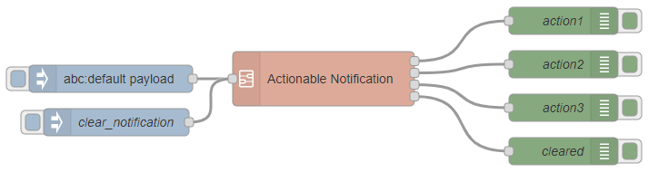
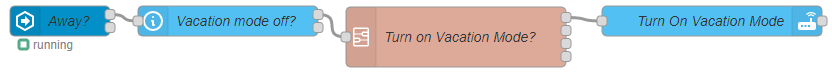

# Actionable Notifications Subflow for Android

::: tip Questions and Discussion
Post questions and follow the discussion about this recipe [here](https://github.com/zachowj/node-red-contrib-home-assistant-websocket/discussions/311)
:::

v2.0.0

@[code](@examples/cookbook/actionable-notifications-subflow-for-android/subflow_2_0_0.json)

:::details Old versions

v1.1.0 - Requires version 0.68.0

@[code](@examples/cookbook/actionable-notifications-subflow-for-android/subflow_1_1_0.json)

**Changes**

- Added selectable Home Assistant server config
- Change service from text input to dropdown

v1.0.1 - Requires version 0.68.0

@[code](@examples/cookbook/actionable-notifications-subflow-for-android/subflow_1_0_1.json)

- Updated to use the new action node

v1.0.0

- Any setting can be set or overwritten using `msg.actionable` to pass a notification object into the node.

@[code](@examples/cookbook/actionable-notifications-subflow-for-android/subflow_1_0_0.json)

v0.0.0

@[code](@examples/cookbook/actionable-notifications-subflow-for-android/subflow.json)

:::

| Options        | Description                                                                                            |                                                             Documentation                                                             |
| -------------- | ------------------------------------------------------------------------------------------------------ | :-----------------------------------------------------------------------------------------------------------------------------------: |
| HA config      | Home Assistant configuration node                                                                      |                                                                                                                                       |
| Notify Service | Can take multiple services as a comma delimited list e.g.: `mobile_app_username, mobile_app_username2` |                                                                                                                                       |
| Title          | Top line of text                                                                                       |                          [link](https://companion.home-assistant.io/docs/notifications/notifications-basic)                           |
| Message        | Second line of text accepts HTML tags                                                                  |        [link](https://companion.home-assistant.io/docs/notifications/notifications-basic#notification-message-html-formatting)        |
| Action Title   | The button title                                                                                       | [link](https://companion.home-assistant.io/docs/notifications/actionable-notifications#building-automations-for-notification-actions) |
| Action URI     | lovelace dashboard, `https://` or `app://`. If URI is defined no action is returned to Node-RED        | [link](https://companion.home-assistant.io/docs/notifications/actionable-notifications#building-automations-for-notification-actions) |
| User Info      | Will resolve user info in Node-RED and place it in `msg.userData`                                      |                                                                                                                                       |
| Sticky         | Set whether to dismiss the notification upon selecting it or not                                       |                [link](https://companion.home-assistant.io/docs/notifications/notifications-basic#sticky-notification)                 |
| Group          | string                                                                                                 |          [link](https://companion.home-assistant.io/docs/notifications/notifications-basic#thread-id-grouping-notifications)          |
| Color          | Color name or the hex code                                                                             |                 [link](https://companion.home-assistant.io/docs/notifications/notifications-basic#notification-color)                 |
| Timeout        | How long a notification will be shown on a users device before being removed automatically             |                [link](https://companion.home-assistant.io/docs/notifications/notifications-basic#notification-timeout)                |
| Icon           | Path to icon                                                                                           |                 [link](https://companion.home-assistant.io/docs/notifications/notifications-basic#notification-icon)                  |

Any setting can be set or overwritten using `msg.actionable` to pass a notification object into the node.

## Demo flow

@[code](@examples/cookbook/actionable-notifications-subflow-for-android/demo.json)

## Use Case 1: Get a notification when garage door is left open with ability to ignore the alert for an amount of time

@[code](@examples/cookbook/actionable-notifications-subflow-for-android/use-case-01.json)

**Required Nodes**

- [time-range-switch](https://flows.nodered.org/node/node-red-contrib-time-range-switch)

## Use Case 2: Ask if vacation mode should be turned on after being away for 24 hours

@[code](@examples/cookbook/actionable-notifications-subflow-for-android/use-case-02.json)

**Also see:**

- [Cookbook: Vacation Mode](./vacation-mode.md)
