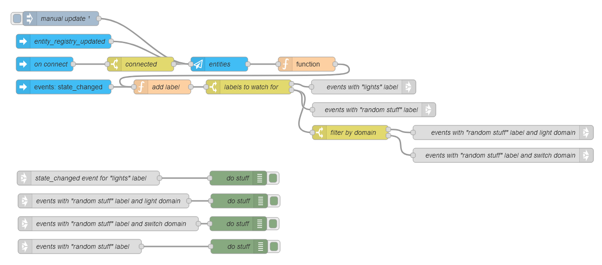

# Events by Label

Here's a flow inspired by a feature request that listens for **`state_changed`** events with a specific label. This is great for filtering by domain or capturing all events linked to a particular label.

:bulb: **What it does:**

- Listens for `state_changed` events in Home Assistant.
- Filters events based on a defined label.
- Option to filter by domain or capture all events with that label.

@[code](@examples/cookbook/events-by-label.json)
