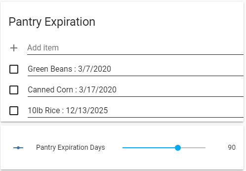

# Expiration Date Monitor with notification

Originally posted
[here](https://community.home-assistant.io/t/json-object-of-all-input-texts/177146/6)
on the Home Assistant Forums.

Here's a demo showing how to build a system to track the expiration date of items in the pantry. Using the Home Assistant [Shopping List](https://www.home-assistant.io/integrations/shopping_list/) as a way to input and update a list of
items and their expiration date.

The format of the name in the shopping list would be `[item] : [expiration date]` with a colon separating the item name from the expiration date.

## Home Assistant stuff

First, you would have to activate the shopping list in the config. <https://www.home-assistant.io/integrations/shopping_list/>

```yaml
# Example configuration.yaml entry
shopping_list:
```

There's already a lovelace card for the shopping list. I also added an `input_number` to dynamically control the expiration window to check.

```yaml
# Example configuration.yaml entry
input_number:
  pantry_expiration:
    name: Pantry Expiration Window
    initial: 90
    min: 30
    max: 120
    step: 1
    unit_of_measurement: days
    icon: mdi:calendar-clock
```

Simple Lovelace config



```yaml
type: vertical-stack
cards:
  - title: Pantry Items
    type: shopping-list
  - type: entities
    entities:
      - input_number.pantry_expiration
```

## Node-RED stuff

You can set the inject node to fire at a set time each day or every other day whatever fits your needs.


<<< @/examples/cookbook/expiration-date-monitor/export.json


There's a lot more polish that could go into this such as being notified if the date entered in the shopping list is invalid or doesn't have a date at all. Sort the expired list so that the closest to expiring is at the top.
