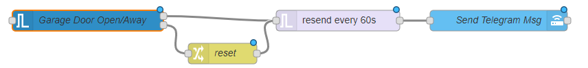

# Garage Door Notification

notify when garage door is left open and repeat until
https://community.home-assistant.io/t/garage-door-open-sensor-alert/135717/3



```
[{"id":"98c7a0e7.fcec1","type":"trigger-state","z":"fac037bf.a42d78","name":"Garage Door Open/Away","entityid":"sensor.garagedoor,input_boolean.home_empty","entityidfiltertype":"substring","debugenabled":false,"constraints":[{"id":"p86n1c79c48","targetType":"entity_id","targetValue":"sensor.garagedoor","propertyType":"current_state","propertyValue":"new_state.state","comparatorType":"is","comparatorValueDatatype":"str","comparatorValue":"on"},{"id":"n01nnkl1a0l","targetType":"entity_id","targetValue":"input_boolean.home_empty","propertyType":"current_state","propertyValue":"new_state.state","comparatorType":"is","comparatorValueDatatype":"str","comparatorValue":"on"},{"id":"c3qle2tykwl","targetType":"entity_id","targetValue":"input_boolean.house_guests","propertyType":"current_state","propertyValue":"new_state.state","comparatorType":"is","comparatorValueDatatype":"str","comparatorValue":"off"}],"constraintsmustmatch":"all","outputs":2,"customoutputs":[],"outputinitially":false,"state_type":"str","x":190,"y":1360,"wires":[["4c5febc.34ef014"],["2ba7a4e1.2598ac"]]},{"id":"4c5febc.34ef014","type":"trigger","z":"fac037bf.a42d78","op1":"","op2":"0","op1type":"pay","op2type":"str","duration":"-60","extend":false,"units":"s","reset":"","bytopic":"all","name":"","x":554,"y":1360,"wires":[["135d46ba.596d39"]]},{"id":"2ba7a4e1.2598ac","type":"change","z":"fac037bf.a42d78","name":"reset","rules":[{"t":"set","p":"reset","pt":"msg","to":"true","tot":"bool"}],"action":"","property":"","from":"","to":"","reg":false,"x":386,"y":1408,"wires":[["4c5febc.34ef014"]]},{"id":"135d46ba.596d39","type":"api-call-service","z":"fac037bf.a42d78","name":"Send Telegram Msg","version":1,"service_domain":"","service":"","entityId":"","data":"","dataType":"json","mergecontext":"","output_location":"","output_location_type":"none","mustacheAltTags":false,"x":788,"y":1360,"wires":[[]]}]
```
