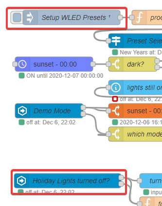

# Holiday lights scheduler and demo mode for WLED

Here's a flow that's been in use for 3-4 years to control some outdoor house LEDs hooked up to an ESP8266 running [WLED](https://github.com/Aircoookie/WLED).

The holiday lights turn on each day at sunset and then off at midnight. It uses [WLED](https://github.com/Aircoookie/WLED) presets based on the day or season. It has a demo mode that will either cycle through all the defined presets or all the included effects.


<<< @/examples/cookbook/holiday-lights-scheduler-and-demo-mode-for-wled/holiday-lights-scheduler-and-demo-mode-for-wled.json

::: tip
If you have any questions about this flow please post them to [this topic](https://community.home-assistant.io/t/example-holiday-lights-scheduler-and-demo-mode-for-wled/252808?u=kermit) on the Home Assistant forums.
:::

## Requirements

- [Node-RED](https://nodered.org/) v1+
- [Home Assistant](https://home-assistant.io) v0.118+
- [WLED](https://github.com/Aircoookie/WLED) v0.10

This is working with [WLED](https://github.com/Aircoookie/WLED) v0.10, not v0.11 as the presets have been fully redesigned, and [Home Assistant](https://home-assistant.io) v0.118 for the WLED preset service. The Home Assistant nodes to control WLED could be replaced with WLED nodes to sidestep then the requirements.

### Integrations

- [Season](https://www.home-assistant.io/integrations/season/)
- [Node-RED](https://github.com/zachowj/hass-node-red) - _custom integration_

The season integration is used to determine the current season and set a [WLED](https://github.com/Aircoookie/WLED) preset if no other holiday range is defined.

The two entity nodes will require the Node-RED custom integration but the flow will function fine without it. The UI just won't have the updated current preset and demo effect displayed.

### Nodes

- [eztimer](https://flows.nodered.org/node/node-red-contrib-eztimer)
- [time-range-switch](https://flows.nodered.org/node/node-red-contrib-time-range-switch)

## Setup

The flow has been modified so that it should run pretty much out of the box after changing the entity id for the light and setting up the JSON object that maps names to [WLED](https://github.com/Aircoookie/WLED) presets.

1. [Setting up WLED Presets](#presets)
2. [Setting entity id](#entity-id-of-the-wled-light)
3. [Modifing holiday date ranges](#setting-date-ranges-up)
4. [Creating Home Assistant entities](#home-assistant-entities)

### Presets


Edit the inject node, **Setup WLED Presets**, and there will be a JSON object that is a set of key/value pairs. The property, left side, will be an uppercase string that should only be alphanumeric characters and underscores. The value, right side, should be a number corresponding to a [WLED preset number](https://github.com/Aircoookie/WLED/wiki/Presets#earlier-versions-up-to-010).

### Entity id of the WLED light



The entity of your WLED light needs to be changed in two places.

### Setting date ranges up

Holidays can be either a single day or a range of dates. If no holiday is defined for the current day it will default to the season preset `WINTER`, `SPRING`, `SUMMER`, and `AUTUMN`.


In the `date ranges` node, a lot is going on but the main thing is the if statement that determines which preset to use.

The `isToday` function can take two arguments but only the first one is required which is the start date of the holiday. The second argument is the end day of the holiday. Both of the arguments can take a number in the format of MONTHDAY or a string name defined in the `getHolidayDate` function on line #60.

Line Numbers 16-40

```javascript
// Winter
if (isToday(214)) preset = presets.VALENTINE;
// President's Day changes every year, Veteran's Day & Flag Day always the same date
// 6/14 Flag Day
// 11/11 Veterans Day
else if (
  isToday(614) ||
  isToday(1111) ||
  isToday("President's Day") ||
  isToday("Memorial Day")
)
  preset = presets.USA;
else if (isToday(317)) preset = presets.ST_PATTY;
else if (isToday("Easter")) preset = presets.EASTER;
// Spring
else if (isToday(504)) preset = presets.STARWARS;
else if (isToday(505)) preset = presets.CINCO_DE_MAYO;
// Summer
else if (isToday(704)) preset = presets.INDEPENDENCE_DAY;
// Autumn
else if (isToday(1017, 1031)) preset = presets.HALLOWEEN;
else if (isToday("Thanksgiving Day")) preset = presets.FALL;
else if (isToday(1231)) preset = presets.NEW_YEARS;
else if (isToday("Thanksgiving Day", 1231) || isToday(101, 106)) {
  const activePreset = states[entityId].attributes.preset;
  preset = getRandomPreset(christmasPresets.filter((e) => e !== activePreset));
  updateInterval = 60;
} else {
  const currentSeason = states["sensor.season"].state;
  preset = presets[currentSeason.toUpperCase()];
}
```

### Home Assistant Entities

Three entities will need to be created in Home Assistant two [input_select](https://www.home-assistant.io/integrations/input_select/) and an [input_number](https://www.home-assistant.io/integrations/input_number/). The helpers configuration, `Configuration > Helpers`, can be used or writing them in YAML.

#### input_number.holiday_lights_demo_mode_delay

```yaml
input_number:
  holiday_lights_demo_mode_delay:
    name: Cycle Delay
    initial: 30
    min: -5
    max: 300
    step: 5
    icon: "mdi:timer-sand"
```


#### input_select.holiday_lights_demo_mode

```yaml
input_select:
  holiday_lights_demo_mode:
    name: Mode
    options:
      - off
      - cycle effects
      - cycle presets
    initial: off
    icon: "mdi:animation"
```


#### input_select.holiday_lights_presets

```yaml
input_select:
  holiday_lights_presets:
    name: Presets
    options:
      - none
    icon: "mdi:animation"
```

::: tip
This one can have any values as the options as they will get overwritten each time the WLED presets are edited in Node-RED.
:::


## Lovelace UI


```yaml
title: Holiday Lights
type: entities
entities:
  - type: conditional
    conditions:
      - entity: sensor.holiday_lights_current_preset
        state_not: none
      - entity: sensor.holiday_lights_current_preset
        state_not: "off"
      - entity: input_select.holiday_lights_demo_mode
        state: "off"
    row:
      entity: sensor.holiday_lights_current_preset
  - entity: light.holiday_lights
  - entity: input_select.holiday_lights_presets
  - type: section
    label: Demo Mode
  - type: conditional
    conditions:
      - entity: input_select.holiday_lights_demo_mode
        state_not: "off"
    row:
      entity: sensor.holiday_lights_demo_current
  - entity: input_select.holiday_lights_demo_mode
  - entity: input_number.holiday_lights_demo_mode_delay
```

## Things that could have been added but never got around to it

- Previous and Next button in the demo UI
