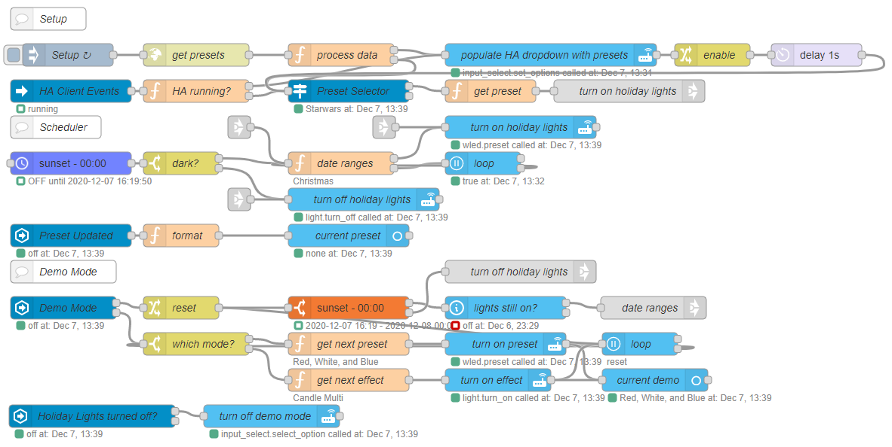
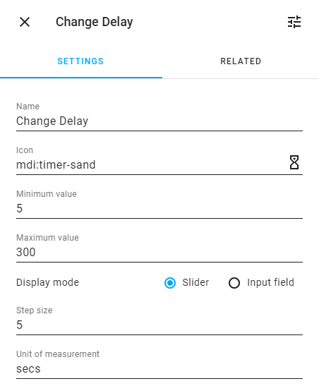
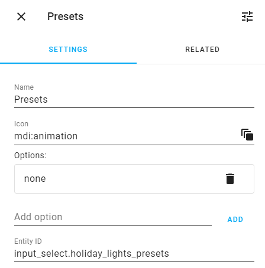
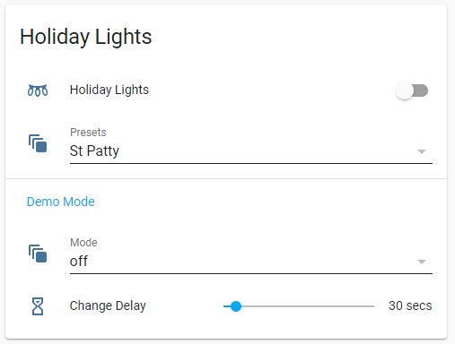

# Holiday lights scheduler and demo mode for WLED

::: tip Questions and Discussion
Post questions and follow the discussion about this recipe [here](https://github.com/zachowj/node-red-contrib-home-assistant-websocket/discussions/306)
:::

Here's a flow to control some outdoor house LEDs hooked up to an ESP8266 running [WLED](https://github.com/Aircoookie/WLED).

The holiday lights turn on each day at sunset and then off at midnight. It uses [WLED](https://github.com/Aircoookie/WLED) presets based on the day or season. It has a demo mode that will cycle through all the defined presets or all the included effects.



<<< @/examples/cookbook/holiday-lights-scheduler-and-demo-mode-for-wled/holiday-lights-scheduler-and-demo-mode-for-wled.json

## Requirements

- [Home Assistant](https://home-assistant.io) v0.118+
- [WLED](https://github.com/Aircoookie/WLED) v0.11+

[Home Assistant](https://home-assistant.io) v0.118 is required for the WLED preset service. The Home Assistant nodes to control WLED could be replaced with WLED nodes to sidestep these requirements.

### Integrations

- [Season](https://www.home-assistant.io/integrations/season/)
- [Node-RED](https://github.com/zachowj/hass-node-red) - _custom integration_

The season integration is used to determine the current season and set a [WLED](https://github.com/Aircoookie/WLED) preset if no other holiday range is defined.

The two entity nodes will require the Node-RED custom integration but the flow will function fine without it. The UI just won't have the updated current preset and demo effect displayed.

### Nodes

- [eztimer](https://flows.nodered.org/node/node-red-contrib-eztimer)

## Setup

The flow has been modified so that it should run pretty much out of the box after changing the entity id for the light and IP for the WLED controller.

1. [Setting up WLED variables](#wled-variable)
1. [Modifing holiday date ranges](#setting-date-ranges-up)
1. [Creating Home Assistant entities](#home-assistant-entities)

### WLED variables


Edit the inject node, **Setup**, to edit the Home Assistant entity id of the holiday lights and IP address of the WLED controller. The entity of your WLED light needs to be changed in two places.

### Setting date ranges up

Holidays can be either a single day or a range of dates. If no holiday is defined for the current day it will default to the season preset `WINTER`, `SPRING`, `SUMMER`, and `AUTUMN`.


In the `date ranges` node, a lot is going on but the main thing is the switch statement that determines which preset to use.

The `isToday` function can take two arguments but only the first one is required which is the start date of the holiday. The second argument is the end date of the holiday. Both of the arguments can take a number in the format of MONTHDAY or a holiday name defined in the `getHolidayDate` function on line #92.

Lines 16 - 72

```javascript
switch (true) {
  // Winter
  case isToday(214):
    preset = "Valentine";
    break;
  // President's Day changes every year, Veteran's Day & Flag Day always the same date
  case isToday(614): // 6/14 Flag Day
  case isToday(1111): // 11/11 Veterans Day
  case isToday("President's Day"):
  case isToday("Memorial Day"):
    preset = "Red, White, and Blue";
    break;
  case isToday(317):
    preset = "St Patty";
    break;
  case isToday("Easter"):
    preset = "Easter";
    break;
  // Spring
  case isToday(504):
    preset = "Starwars";
    break;
  case isToday(505):
    preset = "Cinco de Mayo";
    break;
  // Summer
  case isToday(704):
    preset = "Independence Day";
    break;
  // Autumn
  case isToday(1017, 1031):
    preset = "Halloween";
    break;
  case isToday("Thanksgiving Day"):
    preset = "Autumn";
    break;
  case isToday(1231):
    preset = "New Years";
    break;
  case isToday("Thanksgiving Day", 1231):
  case isToday(101, 106):
    const activePreset = states[entityId].attributes.preset;
    const presetName = idLookup[activePreset];
    preset = getRandomPreset(christmasPresets.filter((e) => e !== presetName));
    updateInterval = 60;
    break;
  default:
    const seasons = {
      winter: "Winter",
      spring: "Spring",
      summer: "Summer",
      autumn: "Autumn",
    };
    const currentSeason = states["sensor.season"].state;
    preset = seasons[currentSeason];
    break;
}
```

### Home Assistant Entities

Three entities will need to be created in Home Assistant two [input_select](https://www.home-assistant.io/integrations/input_select/) and an [input_number](https://www.home-assistant.io/integrations/input_number/). The helpers configuration, `Configuration > Helpers`, can be used or writing them in YAML.

#### input_number.holiday_lights_demo_mode_delay

```yaml
input_number:
  holiday_lights_demo_mode_delay:
    name: Cycle Delay
    initial: 30
    min: -5
    max: 300
    step: 5
    icon: "mdi:timer-sand"
```



#### input_select.holiday_lights_demo_mode

```yaml
input_select:
  holiday_lights_demo_mode:
    name: Mode
    options:
      - off
      - cycle effects
      - cycle presets
    initial: off
    icon: "mdi:animation"
```


#### input_select.holiday_lights_presets

```yaml
input_select:
  holiday_lights_presets:
    name: Presets
    options:
      - none
    icon: "mdi:animation"
```

::: tip
This one can have any values as the options as they will get overwritten each time the WLED presets are edited in Node-RED.
:::



## Lovelace UI



```yaml
title: Holiday Lights
type: entities
entities:
  - type: conditional
    conditions:
      - entity: sensor.holiday_lights_current_preset
        state_not: none
      - entity: sensor.holiday_lights_current_preset
        state_not: "off"
      - entity: input_select.holiday_lights_demo_mode
        state: "off"
    row:
      entity: sensor.holiday_lights_current_preset
  - entity: light.holiday_lights
  - entity: input_select.holiday_lights_presets
  - type: section
    label: Demo Mode
  - type: conditional
    conditions:
      - entity: input_select.holiday_lights_demo_mode
        state_not: "off"
    row:
      entity: sensor.holiday_lights_demo_current
  - entity: input_select.holiday_lights_demo_mode
  - entity: input_number.holiday_lights_demo_mode_delay
```

## Things that could have been added but never got around to it

- Previous and Next button in the demo UI
