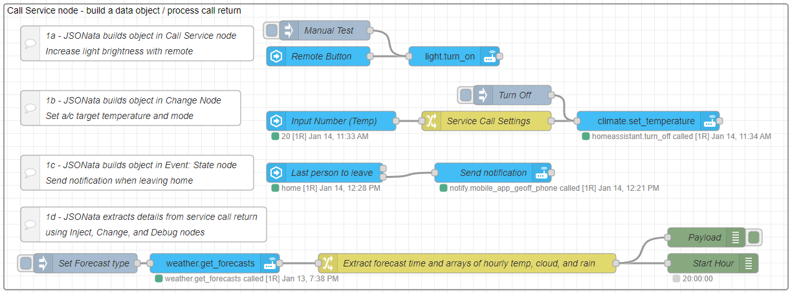

# JSONata Examples 1 - Call Service

Integrations in Home Assistant provide _service calls_ that can be used, for example, to set target temperature on heaters and air-conditioning units. All service calls can be found and tested within Home Assistant Developer toolbox, and it is also useful to check the integration documentation to identify exactly what is required for a successful service call.

**All service calls require:**

- a domain (integration platform) such as 'climate',
- a service call within this domain, such as 'set_temperature',
- a target entity or entities (or area or device containing entities) to apply the service to,
- a JSON _data object_, containing any additional required and optional parameters.

The data object will vary, depending on the integration and service call, from an empty object `{}` to something much more complex. Constructing this data object correctly is key to a successful service call, and **JSONata** rather than mustache templating should ideally be used to achieve this.

**Note:** The data field used in a service call must be a valid JSON object.

- Mustache templates are delimited with '{{msg.payload}}'. This is _invalid_ syntax in JSONata expressions and must not be used.
- Home Assistant uses YAML constructs, containing space-tabulation for objects and '-' for arrays. This format is incompatible with both JSON and JSONata, but YAML can be converted to JSON.
- The data UI field option typically offers two input methods:
    - `{}` for JSON - this _must_ be strict JSON formed with all literals and string keys. Mustache templates _may_ work successfully in simple strings.
    - `J:` for JSONata (expression) - this must _evaluate_ to strict JSON, but can be formed with expressions in both the object keys (evaluating as strings) and the object values. Literals evaluate as themselves, so the JSONata option can accept JSON literal, but the JSON option cannot accept anything other than literals and Mustache templates.

**JSONata and the Call Service node:**

For Node-RED flows with a **Call Service** node there are three locations where the _data object_ can be defined.

- Directly in the Service Call node UI 'Data' field, using the JSONata option.
- In a preceeding Change Node, passing the Service Call settings in a _msg.payload_ object.
- In flow trigger nodes, such as Events: state node, as an output _msg.payload_ object.

There are advantages and drawbacks to each approach, and personal choice as well as the particular flow will influence your flow design.



Here are three examples, each using JSONata to set the required data object, and one example of using JSONata to process service call return data.

@[code](@examples/cookbook/jsonata-examples/service_call.json)


## Setting the _Data_ field

### Increase lights brightness with remote

**Example:** A remote with a button that when clicked increases the brightness of a given light by an amount that is set from an input_number inside Home Assistant.

JSONata expression in the Call Service node UI Data field. Nothing special is required as input to this node as all the settings are completed within the node itself.

```json
{
  "brightness": $min([
    $entities("light.kitchen").attributes.brightness +
      $number($entities("input_number.brightness").state),
    255
  ])
}
```

### Setting target temperature on air-conditioning unit

**Example:** Set the target temperature (and mode) for air-conditioning unit from msg.payload value.

Here a Change node is used to build the msg.payload object required to set the Call Service node parameters, including the nested data field. In a Change node, the special WebSocket `$entity()` and `$entities()` functions are _not_ available, however we can still perform a read from global context using the Node-RED `$globalContext()` function.

```json
{
   "target": {"entity_id": $globalContext("AClist")},
   "data": {
       "temperature": payload,
       "hvac_mode": payload>20 ? "heat" : "cool"
   }
}
```

The Call Service node can accept from one to all of the UI parameters in msg.payload, and where given these take precedence over any UI settings. Default settings can therefore be set in the UI, and then be over-riden by the input message, including using settings from Inject nodes as shown in the example.

### Notification of lights left on when leaving home

**Example:** Get notified when lights or switches are left on when you leave.

This example uses JSONata in two places in the **Events: state** node. The state value test is a JSONata expression that must return true for the node to output a message (upper output). This code selects an array of all entity states for entities starting with 'person', and will return `true` if this array contains any with state "home". The expression will therefore only return `false` when no-one is home, and we can use the lower (condition fail) output rather than using the JSONata $not() function to look for '_not_ home'.

```json
"home" in $entities().*[$substringBefore(entity_id,".")="person"].state
```


JSONata is then also used in the output properties to create the required object for a notification service call. It uses `$entities().*` with a filter looking for those with "light" or "switch" in the entity_id and state "on", then selecting the friendly_name, and joining all those found into a string list in the message.

The message title uses `$entity().attributes.friendly_name` to add the name of the person who just left home to the message title.

```json
{
    "data": {
        "message": "The " & 
          $join($entities().*[state = "on" and entity_id ~>
          /^light|^switch/].attributes.friendly_name, ", ") &
          " are on.",
        "title": "Things Left On " & $entity().attributes.friendly_name
    }
}
```

In this example all the parameter setup is performed in the Events: state node, and the Call Service node accepts all the required parameters from the input msg.payload object.

## Processing a service call _return_

Home Assistant service calls can provide data returned as a result of the call, and JSONata is an ideal tool to manage any resulting JSON object and array structures. This example uses JSONata to extract and manipulate weather forecasts, providing a summary in a modified format.

**Example:** The forecast service call now returns an array of forecasts. JSONata is used to iterate over all forecast, returning an new object for each, with a time and arrays for tempeature, cloud coverage, and precipitation only.

```json
results.*.forecast{
   "time": $[0].datetime,
   "temp": $.temperature,
   "cloud": $.cloud_coverage,
   "rain": $.precipitation
}
```

**Also see:**

- [JSONata guide](../guide/jsonata.md)
- [JSONata primer](../guide/jsonata-primer.md)
