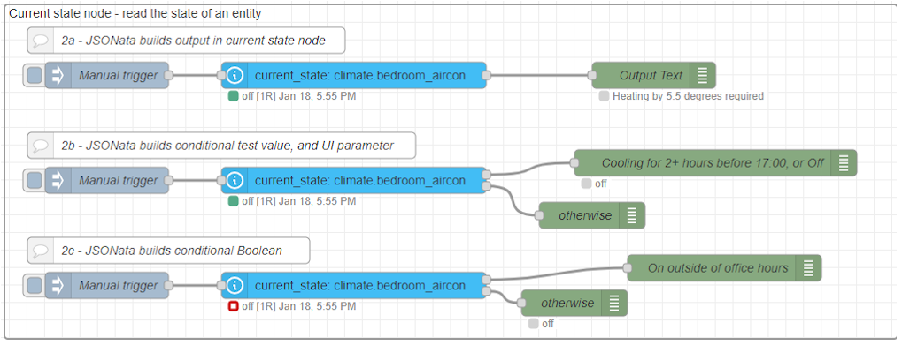

# JSONata Examples 2 - Current State

The **Current State** node has several opportunites to use JSONata. This example demonstrates all of these, using a node to fetch the current state of a climate air-conditioning unit.

The default output values for this node include setting **msg.payload** to the _state_ (which for an A/C unit will be "off", "heat", "cool" or more, depending on the integration) as well as **msg.data** to the entire _entity data object_. This holds values for the last changed timestamp as well as attributes such as the friendly name and other integration dependent settings.



Here are three examples, showing how to use JSONata to build **output properties**, to perform **If-State conditional tests**, and to provide **calculated values for UI settings**.

@[code](@examples/cookbook/jsonata-examples/current-state.json)

### Creating _output_ properties

**Example:** Report the difference between room temperature and target tempterature for an air-conditioning unit.

In the first example we are looking to retrieve the current state and attributes from an air-conditioning unit, and output a text message describing the difference between current and target temperature. The A/C unit current temperature (read only) and the A/C unit target temperature (can be set with a service call) are located in the entity attributes. These are both numbers, so it is very easy to calculate the difference.

Using JSONata to build an output message property, there is no necessity to retain the default settings for msg.data unless this is required later in the flow.

```json
(
    $att:=$entity().attributes;
    $diff:=$att.temperature-$att.current_temperature;
    ($diff>0 ? "Heating" : "Cooling") & " by " & $abs($diff) & " degrees required"
)
```
### Providing a conditional test value (JSONata expression as a _value_)

**Example:** Output only where the A/C unit has been cooling for two hours and the local time is before 17:00, or when the unit is off.

The Current state node provides for a _state value test_ opportunity, which if set can be used to direct the message output one of two ways, depending whether the entity state passes or fails the test. When the **If State** option is chosen with a _conditional_ (not JSONata) the condition expects a _value_ to test against. In this example, using JSONata on the right hand side will return the _value_ of the evaluated expression ("cool" before 17:00 and "off" otherwise) to be tested against the current state value and with conditional chosen.


```json
$entities('sensor.time').state < "17:00" ? "cool" : "off"
```
### Generating UI field setting _values_
The Current state node also allows for a **For**, or _duration of state_ test, and here JSONata is again being used to return either '0' when the state is "off" or '2' (hours) when the state is not "off". This complex arrangement will together test for the A/C unit being either immediately off after 17:00, or in cooling mode for at least two hours before 17:00.

```json
$entity().state = "off" ? 0 : 2
```

Note that here the use of `$entity().state` returns the current state of the node's subject entity, and that `$entities('sensor.time').state` returns the state of another specified entity. The [Time & Date Integration](https://www.home-assistant.io/integrations/time_date/) should be added to the configuration file, and then the time sensor will return the current local time. This is useful for local-time condition testing, whereas the time_utc sensor will return UTC-time which is more useful with Home Assistant timestamps.

### Conditional test (JSONata expression as a _Boolean result_)

**Example:** Report the air-conditioning unit on outside of office hours.

When the **If State** option is chosen with _JSONata_ (not a conditional) then the right hand side must be a JSONata expression that returns a Boolean value of either `true` or `false`. When true the "If State" test is successful (the message is output from the top exit) when false the test fails (the message is output from the lower exit).


In this example the JSONata expression is a code block, obtaining the node subject entity state and separate entity local time as in the previous example, but now combining both into one predicate expression. If the local time is outside 09:00 to 17:00 _and_ the state is either heat or cool, then the expression will return `true`.

```json
(
    $state:=$entity().state;
    $time:=$entities('sensor.time').state;
    ($time<="09:00" or $time>="17:00") and ($state="heat" or $state="cool")
)
```

The JSONata at this point can be extensive, using a combination of entity states or attributes and Boolean logic as required. The use of OR to combine various states can only be acheived in this way.
