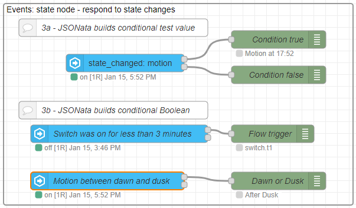

# JSONata Examples 3 - Events: State

The Events: State node receives state change events for one or more entities, and will output a message in response. The message output can be optionally controlled by a test condition on the state value, and also by a test on the length of time the state remains at that value. Both the state test condition and the time length duration can use JSONata. This node can also provide output message properties, again with the ability to use JSONata.

## Using JSONata




@[code](@examples/cookbook/jsonata-new/event-state.json)

### Providing a conditional test value


```json
(
    $time:=$entities('sensor.time').state;
    $append(["on"], $time<"08:30" or $time>"17:30" ? ["off"]);
)    
```

### Conditional test (Boolean)

**Switch has been turned off, and was on for less than three minutes**

```json
(
    $new:=$entity();
    $old:=$prevEntity();
    $mins:=($toMillis($new.last_changed)-$toMillis($old.last_changed))/60000~>$round(0);
    $new.state="off" and $old.state="on" and $mins<3
)

```
**Motion has been detected before dawn or after dusk**

```json
(
    $ismotion:= $entity().state="on";

    $dawn:=$entities('sensor.sun_next_dawn').state;
    $dusk:=$entities('sensor.sun_next_dusk').state;
    $date:=$entities('sensor.date_time_utc').state~>$substringBefore(",");

    $isdawn:= $date=$substringBefore($dawn,"T");
    $isdusk:= $date!=$substringBefore($dusk,"T");
    
    $ismotion and ($isdawn or $isdusk)
)
```


### Creating output properties

```json
(
    $ismotion:= $entity().state="on";

    $dawn:=$entities('sensor.sun_next_dawn').state;
    $dusk:=$entities('sensor.sun_next_dusk').state;
    $date:=$entities('sensor.date_time_utc').state~>$substringBefore(",");

    $isdawn:= $date=$substringBefore($dawn,"T");
    $isdusk:= $date!=$substringBefore($dusk,"T");
    
    $fire:= $ismotion and ($isdawn or $isdusk);

    {"motion": $ismotion,
    "dawn": $dawn,
    "dusk": $dusk,
    "date": $date,
    "isdawn": $isdawn,
    "isdusk": $isdusk,
    "fire": $fire
    }
)

```


### OR conditional for the events: state node

The **trigger-state** node is great if you have several conditions you want to check for but it doesn't allow use of OR conditions. Using a JSONata expression with an **event:state** node will allow you to fill this gap.

Motion sensor at the front door triggers and have a text to speech notification be sent if at least one person is home.

```json
$entity().state = "on" and (
   $entities("person.person1").state = "home" or $entities("person.person2").state = "home"
)
```