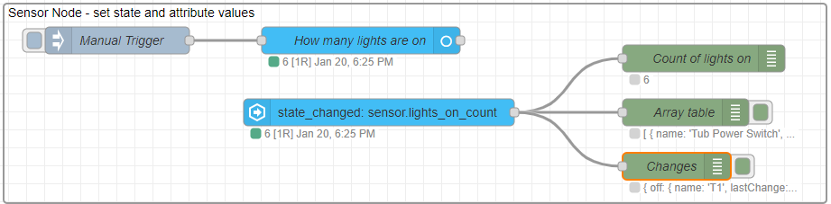

# JSONata Examples 5 - Entity Sensor

Using the WebSocket nodes provides many ways to read events and entity states _from Home_ Assistant into Node-RED. Sending data the other way requires the use of the **Entity** nodes.

There are several, but they all work in much the same way, and this example will use the **Entity: Sensor** node to create a sensor in Home Asisstant, and then to update the sensor state value as well as add an attribute value.



Here is an example, showing how to use JSONata to set **state value**, and **attribute value** settings for an entity-sensor node.

@[code](@examples/cookbook/jsonata-examples/entity-sensor.json)

### Setting the sensor state value

**Example:** Provide a sensor with the count of lights that are on.

Once a new entity has been registered with Home Assistant, the entity state value can be updated by passing a message with the new value. Usually msg.payload is used, however it is possible to use a JSONata expression to generate the new state value.

```json
$entities().*[state = "on" and entity_id ~> /^light|^switch/] ~> $count()
```

Here the `$entities()` function is used to return all entities, and select those that have 'light' or 'switch' in the entity id, and have an 'on' state. This will return an array, which can be counted to obtain the total number of switches or lights that are on.

### Setting an attribute value

**Example:** Provide an array list of the lights that are on.

The entity state value can only be a JSON primative value, such as a number, and objects and arrays can only be passed using the entity attributes.

```json
$entities().*[state = "on" and entity_id ~> /^light|^switch/].{
    "name": attributes.friendly_name,
    "lastChange": last_changed}
```

The JSONata expression here first returns a similar array of lights and switches, but then builds an array of objects. Each object contains the friendly name and last changed timestamp for each light or switch. This array is set into an attribute value.

### Responding to state changes using JSONata

**Example:** Since I last looked, which lights have been turned on, or off?

In addition to the node above, the example also shows an **Event: state** node responding to the above sensor update.

```json
(
    $old:=$prevEntity().attributes.lights_table;
    $new:=$entity().attributes.lights_table;
    {"on": $new[$not(name in $old.name)],
     "off": $old[$not(name in $new.name)]
    }
)
```

In an Event node, the `$entity()` function returns the current or new entity details, and the `$prevEntity()` function the previous or old entity details. The JSONata here picks out the sensor attribute and compares the array of lights & switches before and after the state change. An object with an array list of lights or switches that have been turned on, and those turned off, is provided.

**Note:** In this example the **Entity Sensor** node is updated on demand. The state value of the associated Home Assistant entity, which is a count of the number of lights or switches that are on, _will only be updated when the Sensor node is triggered_. The **Events: state** node is responding to changes in the sensor node state value, which will only happen when the sensor node is updated, and _not_ when a light or switch is turned on or off.