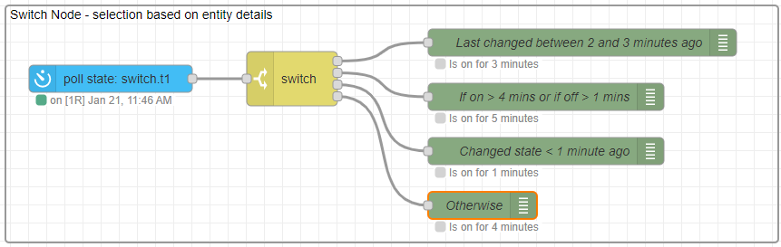

# JSONata Example 6 - Switch Node

The _Switch_ node and the _Change_ node are standard Node-RED nodes that provide conditional routing (selection) and data manipulation respectively for flow messages. Many of the WebSocket nodes, when using JSONata, can provide some output property data manipulation, and a few nodes also offer simple binary message routing. However, much more can be acheived using the Switch and Change nodes.



This example shows how to use JSONata within the standard Switch node.

@[code](@examples/cookbook/jsonata-examples/switch-node.json)

### Using JSONata in switch routing

A Poll State node has been setup to return every 10 seconds the entity state of a light switch. This will return the 'entity state' ("on" or "off") as the msg.payload value. It will also return the 'entity state' details in msg.data, which includes the `timeSinceChangedMs` field.

**JSONata for the routing property**

```json
$round(data.timeSinceChangedMs/60000,0)
```

The routing rules will test against the given _property_. By default this would be the value held in msg.payload. Using a JSONata expression here allows for a computation on the time since changed field to convert this to minutes. Rounding is also being used, so 31 to 89 seconds would become 1 minute.

**Note** that the JSONata expression has access to the full message. The value required was output from the Poll State node within the msg.data field, and this has to be used here since the `$entity()` functions are not available outside of the WebSocket nodes.


**JSONata for the rule value**

1. In the first rule, the rule test values are given as literals.

2. In the second rule, the rule test value is provided by a JSONata expression. This will return either 4, if the light state is "on", or 1 if the light state is "off".

**Note** that 'payload' could have been used rather than 'data.state'. Where the output of a WebSocket node is used later in the flow for routing or processing, care should be taken to generate the most appropriate output. For example, rather than generate the Property value here, the JSONata could be used in the Poll State node to provide minutes since last changed in the output msg.payload directly.

```json
data.state="on" ? 4 : 1
```

**JSONata expression for the routing match**

3. In the third rule, the evaluation property is not used, and the test condition is the Boolean result of a JSONata expression. The routing path is taken only if the JSONata expression evaluates as `true`.

```json
data.timeSinceChangedMs < 60000
```

The example is simplistic, however it shows that any message property can be used within the expression.

**Note** that, since the `$entities()` function is not available here, to obtain other entity values, JSONata can be used in the preceeding Poll State node as an output property, for example by setting msg.time to `$entities('sensor.time').state` to provide 'time' as an available value in the Switch node.

4. For completeness in these notes, a last rule of 'Otherwise' has been included, and the matching rules set to 'checking all rules'. This will mean that more than one of the first three rules may match at the same time, but that the last route is only taken when no other rule matchs.

**JSONata expression in the debug node**

The Debug nodes also contain JSONata as a further demonstration of how versatile this language can be.