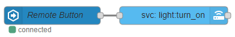
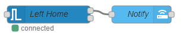
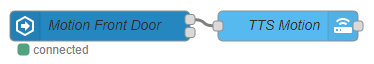

# JSONata Examples

## Increase lights brightness with remote

A remote with a button that when clicked it increases the brightness of a given light by an amount that is set from an input_number inside Home Assistant.



@[code](@examples/cookbook/jsonata/increase-lights-brightness-with-remote.json)

JSONata expression in the call-service node

```json
{
  "brightness": $min([
    $entities("light.kitchen").attributes.brightness +
      $number($entities("input_number.brightness").state),
    255
  ])
}
```

## Notification of lights left on when leaving home

Get notified when light or switch is left on when you leave. This a remake of Example #1 from this [post](https://community.home-assistant.io/t/examples-for-using-the-new-get-entities-node/85777) showing how to manipulate entities and get the desired output.



@[code](@examples/cookbook/jsonata/notification-of-lights-on-when-leaving-home.json)

This is the same as above but uses an event:state node and shows how to use the `$entity()` and `$prevEntity()` functions to compare states.



@[code](@examples/cookbook/jsonata/notification-of-lights-on-when-leaving-home_02.json)

Event-State Node:
`$entity().state != $prevEntity().state`

Call-Service Node:

```json
{
     "message": "The " & $join($entities().*[state = "on" and entity_id ~> /^light|^switch/].attributes.friendly_name, ", ") & " are on.",
     "title": "Left On"
}
```

## OR conditional for the events: state node

The trigger-state node is great if you have several conditions you want to check for but it doesn't allow you to use OR checks. Using a JSONata expression with an event:state node will allow you to fill this gap.

Motion sensor at the front door triggers and have a text to speech notification be sent if at least one person is home.


@[code](@examples/cookbook/jsonata/or-conditional-for-the-events-state-node.json)

```json
$entity().state = "on" and (
   $entities("person.person1").state = "home" or $entities("person.person2").state = "home"
)
```

**Also see:**

- [JSONata guide](../guide/jsonata.md)
