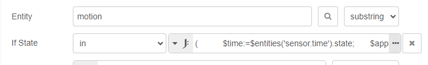
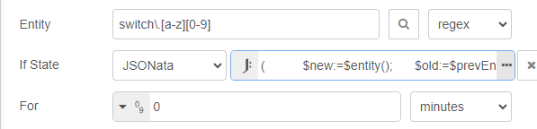

# Events: state

The **Events: state** node receives state change _events_ for one or more entities, and will output a message in response. The message output can be optionally controlled by a test condition on the state value, and also by a test on the length of time the state remains at that value. Both the _state test condition_ and the _state time duration_ can use JSONata. This node can also provide _output message properties_, again with the ability to use JSONata.


Here are three examples, showing how to use JSONata to perform **If-State conditional tests**, and to build **output properties**.

@[code](@examples/cookbook/jsonata-examples/events-state.json)

### Providing a conditional test value (JSONata expression as a _value_)

**Example:** Respond to motion events for both "on" (start of motion detection) all day, and also "off" (end of motion detection) but only outside of 08:30 to 17:30.

```
(
    $time:=$entities('sensor.time').state;
    $append(["on"], $time<"08:30" or $time>"17:30" ? ["off"]);
)
```

When the **If State** option is chosen with a _conditional_ (not JSONata) the condition expects a _value_ to test against. The result of the JSONata expression is the final line in the code block. This creates an array containing just ["on"] or if the time is before 08:30 or after 17:30, an array of ["on", "off"]. The motion sensor entity state will be compared with this array value using the inclusive condition 'in'.



This JSONata uses the Date-Time integration sensor to obtain the local time.
The [Time & Date Integration](https://www.home-assistant.io/integrations/time_date/) should be added to the configuration file, and then the time sensor will return the current local time.

### Conditional test (JSONata expression as a _Boolean result_)

**Example:** Switch has just been turned off, and was previously on for less than three minutes.

When the **If State** option is chosen with _JSONata_ (not a conditional) then the right hand side must be a JSONata expression that returns a Boolean value of either `true` or `false`. When true the "If State" test is successful (the message is output from the top exit) when false the test fails (the message is output from the lower exit).



```
(
    $new:=$entity();
    $old:=$prevEntity();
    $mins:=($toMillis($new.last_changed)-$toMillis($old.last_changed))/60000~>$round(0);
    $new.state="off" and $old.state="on" and $mins<3
)

```

In all the WebSocket nodes, the `$entity()` function will return an object for the entity that is the subject of the node. For the **Event:** nodes, the `$entity()` return is for the _current_ or new state, and an additional `$prevEntity()` function will return a similar object for the _previous_ state. Use of both functions allows JSONata expressions to work with and compare the triggering state change.

**Example:** Motion has been detected before dawn or after dusk.

Here JSONata is again used to generate a Boolean result for the If State test. The expression return is the final line in the code block, which tests for motion and either before dawn or after dusk. The use of 'or' here is an example of how JSONata can extend logic testing since the **Trigger state** node conditions can only group conditions as AND logic.

```
(
    $ismotion:= $entity().state="on";

    $dawn:=$entities('sensor.sun_next_dawn').state;
    $dusk:=$entities('sensor.sun_next_dusk').state;
    $date:=$entities('sensor.date_time_utc').state~>$substringBefore(",");

    $isdawn:= $date=$substringBefore($dawn,"T");
    $isdusk:= $date!=$substringBefore($dusk,"T");

    $ismotion and ($isdawn or $isdusk)
)
```

The _Sun_ integration in Home Assistant provides 'next*dawn' and 'next_dusk' sensors, with a date-time string value in UTC. Since the \_next* dawn will be for today before dawn, but will be for tomorrow after dawn, and similarly the _next_ dusk will be for today before dusk, but for tomorrow after dusk, it is possible to compare just the date parts of the UTC timestamps, so as to determine if the current time is before or after either dawn or dusk.

### Creating _output_ properties

To extend this last example, JSONata is used to generate an **output object**. Note that there is no internal connection between the two JSONata expressions, so all the values have to be recalculated as required.

```
(
    $ismotion:= $entity().state="on";

    $dawn:=$entities('sensor.sun_next_dawn').state;
    $dusk:=$entities('sensor.sun_next_dusk').state;
    $date:=$entities('sensor.date_time_utc').state~>$substringBefore(",");

    $isdawn:= $date=$substringBefore($dawn,"T");
    $isdusk:= $date!=$substringBefore($dusk,"T");

    $fire:= $ismotion and ($isdawn or $isdusk);

    {"motion": $ismotion,
    "dawn": $dawn,
    "dusk": $dusk,
    "date": $date,
    "isdawn": $isdawn,
    "isdusk": $isdusk,
    "fire": $fire
    }
)

```

### OR conditional for the Events: state node

The **Trigger: state** node is great if you have several conditions you want to check for but it doesn't allow use of OR conditions. Using a JSONata expression with an _Event: state_ node will allow you to fill this gap.

**Example:** Motion sensor at the front door triggers, and have a text to speech notification be sent if at least one person is home.

```
$entity().state = "on" and (
   $entities("person.person1").state = "home" or $entities("person.person2").state = "home"
)
```

**Also see:**

- [JSONata guide](../../guide/jsonata/)
- [JSONata primer](../../guide/jsonata/jsonata-primer.md)
