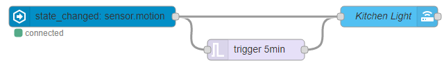
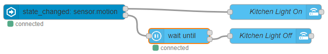

# Motion Triggered Light

## Example 1

A motion sensor that always sends an `on` event when any motion is detected and
continues sending an update on each detection. This example turns a
light on when motion is detected and waits 5 minutes for no motion and turns off
the light.

<<< @/examples/cookbook/motion-triggered-light/example_01.json

## Example 2

A motion sensor that only sends an `on` event once then an `off` event when motion is
no longer detected.

<<< @/examples/cookbook/motion-triggered-light/example_02.json
