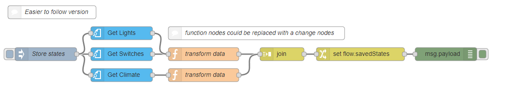

# Saving and Restoring States

Here are several examples using the get-entities node to get the states of
several entities and then how to restore the entity states.

<<< @/examples/cookbook/saving-and-restoring-states/example_01.json

<<< @/examples/cookbook/saving-and-restoring-states/example_02.json

<<< @/examples/cookbook/saving-and-restoring-states/example_03.json

As you can see in the above examples the `switch` and `light` domains are just saving and restoring the state, on/off. But what if some users wanted to also save and restore the brightness level or not. The `climate` domain is saving and restoring more than just the state.

**Also see:**

- [get-entities node](../node/get-entities.md)
