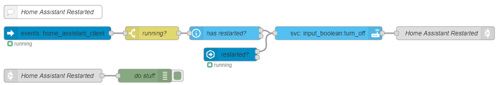

# Starting a flow after a Home Assistant restart

Use a Home Assistant automation to set an input boolean to `on` then from Node-RED check if that input boolean is `on` after a successful connection or at any time it changes to `on`.

## Create an input boolean using the Helpers menu (Configuration -> Helpers)


## Create the Home Assistant automation

```yaml
alias: Home Assistant Restart
description: ""
trigger:
  - platform: homeassistant
    event: start
condition: []
action:
  - service: input_boolean.turn_on
    data: {}
    entity_id: input_boolean.home_assistant_restarted
mode: single
```

## Create the Node-RED flow



<<< @/examples/cookbook/starting-flow-after-home-assistant-restart/example_01.json
