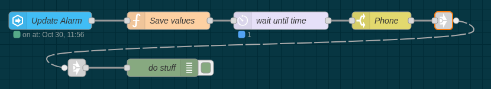

# Using Date and Time entities to trigger flows

There is now a [time](../node/time.md) node that simplifies the example flows below into one node.

## Using the time node

- Home Assistant Companion app next alarm sensor

  <<< @/examples/cookbook/using-date-and-time-entities-to-trigger-flows/example1a_using_time_node.json

- Adding an offset and on/off switch by exposing the node the Home Assistant using the [custom component](https://github.com/zachowj/hass-node-red).

  <<< @/examples/cookbook/using-date-and-time-entities-to-trigger-flows/example1b_using_time_node.json

- Daily alarm using Datetime Entity

  <<< @/examples/cookbook/using-date-and-time-entities-to-trigger-flows/example2_using_time_node.json

## Home Assistant Companion app next alarm sensor

::: warning
Home Assistant Companion app sets the entity's name based on its selected language. Eg. `next_alarm` must be changed in `prossimo_allarme` if the app is used in Italian (and vice versa)
:::

Here's a basic example of using the Home Assistant Companion app next alarm sensor.

<<< @/examples/cookbook/using-date-and-time-entities-to-trigger-flows/example1a.json

### Adding an offset and on/off switch

Using the Helpers section under Configuration in Home Assistant add an `input_boolean` and `input_number` with a min of `-90` and a max of `90`.

In this example they are `input_number.offset` and `input_boolean.next_alarm_enabled`. The offset will be plus or minus minutes to the alarm. The delay node will get updated when either the alarm sensor gets updated, the input boolean gets toggled, or the offset changes.

If the [Node-RED custom component](https://github.com/zachowj/hass-node-red) is installed in Home Assistant there is no need for the `input_boolean` as the event state node can be exposed to Home Assistant as the toggle switch.

<<< @/examples/cookbook/using-date-and-time-entities-to-trigger-flows/example1b.json

::: warning
Delay nodes can have a max timeout of around 24.8 days greater than that and weird things will happen.
:::

### Managing alarm from multiple phones

If more than on phone in the house has the app installed and you want to be triggered by all of them alarms this is the way to go and is't working perfectly even with just one phone.

It needs the same couple of helper for each phone and the same consideration made above for the `input_boolen` is still valid.

This flow was developed and tested with a Pixel 2 XL and the companion app in Italian so you have to change all the references to the phone and to the entities.

<<< @/examples/cookbook/using-date-and-time-entities-to-trigger-flows/example1c.json

## Daily alarm using Datetime Entity

<<< @/examples/cookbook/using-date-and-time-entities-to-trigger-flows/example2.json

An offset can also be added as shown in the next alarm sensor example.
