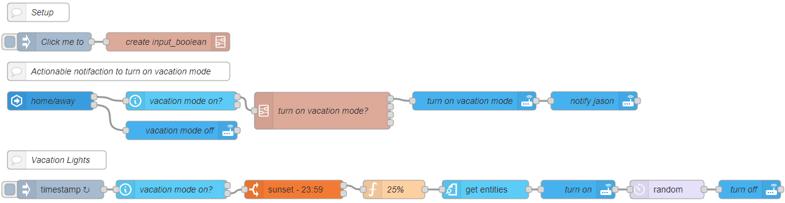
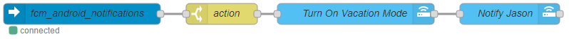
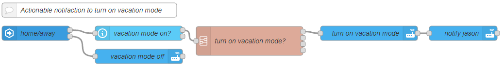

# Vacation Mode

Four steps to adding a vacation mode to your home and having
lights turn on and off at random intervals. It also automatically prompts you with a
notification about turning on vacation mode if you have been gone longer than 24 hours.

## Step 1

Create an input boolean in Home Assistant that will control if the house is in vacation mode.

```yaml
input_boolean:
  vacation_mode:
    name: Vacation Mode
    initial: off
    icon: mdi:beach
```

## Step 2

Create a flow that will automatically change the vacation mode to off if we
come home. Secondly will send our phone an actionable notification asking
if we want to turn on vacation mode if we have been gone longer than 24
hours.



```
[{"id":"60eda076.3a8f1","type":"api-call-service","z":"91a80f99.6180e","name":"Turn on Vacation Mode?","version":1,"debugenabled":false,"service_domain":"notify","service":"jason","entityId":"","data":"{\"title\":\"Vacation Mode\",\"message\":\"You've been aways for 24 hours. Do you want to turn on vacation mode?\",\"data\":{\"tag\":\"vacation-mode-notification\",\"actions\":[{\"action\":\"vacation_mode\",\"title\":\"Turn On\"}]}}","dataType":"json","mergecontext":"","output_location":"payload","output_location_type":"msg","mustacheAltTags":false,"x":686,"y":2240,"wires":[[]]},{"id":"4a2b9b04.6d4b94","type":"server-state-changed","z":"91a80f99.6180e","name":"Home/Away","version":1,"exposeToHomeAssistant":false,"haConfig":[{"property":"name","value":""},{"property":"icon","value":""}],"entityidfilter":"person.jason","entityidfiltertype":"exact","outputinitially":false,"state_type":"str","haltifstate":"not_home","halt_if_type":"str","halt_if_compare":"is","outputs":2,"output_only_on_state_change":true,"x":214,"y":2240,"wires":[["8df8d94e.eff5b8"],["e75fffa3.3c29a","1fdbf9b4.ae5c76"]]},{"id":"8df8d94e.eff5b8","type":"ha-wait-until","z":"91a80f99.6180e","name":"vacation mode on?","outputs":2,"entityId":"input_boolean.vacation_mode","property":"state","comparator":"is","value":"on","valueType":"str","timeout":"1","timeoutUnits":"days","entityLocation":"","entityLocationType":"none","checkCurrentState":true,"blockInputOverrides":true,"x":442,"y":2240,"wires":[[],["60eda076.3a8f1"]]},{"id":"e75fffa3.3c29a","type":"change","z":"91a80f99.6180e","name":"","rules":[{"t":"set","p":"reset","pt":"msg","to":"true","tot":"bool"}],"action":"","property":"","from":"","to":"","reg":false,"x":432,"y":2288,"wires":[["8df8d94e.eff5b8"]]},{"id":"1fdbf9b4.ae5c76","type":"api-call-service","z":"91a80f99.6180e","name":"Vacation Mode Off","version":"1","service_domain":"input_boolean","service":"turn_off","entityId":"input_boolean.vacation_mode","data":"","dataType":"json","mergecontext":"","output_location":"payload","output_location_type":"msg","mustacheAltTags":false,"x":442,"y":2336,"wires":[[]]}]
```

## Step 3

This flow will fire when the actionable notification is triggered to activate vacation mode.



```
[{"id":"c9042706.5587d8","type":"server-events","z":"91a80f99.6180e","name":"fcm_android_notifications","event_type":"fcm_android_notifications.clicked","exposeToHomeAssistant":false,"haConfig":[{"property":"name","value":""},{"property":"icon","value":""}],"x":222,"y":2480,"wires":[["59fb517a.540ad"]]},{"id":"59fb517a.540ad","type":"switch","z":"91a80f99.6180e","name":"action","property":"payload.event.action","propertyType":"msg","rules":[{"t":"eq","v":"vacation_mode","vt":"str"}],"checkall":"true","repair":false,"outputs":1,"x":418,"y":2480,"wires":[["d4ef4bb1.fa73d8"]]},{"id":"d4ef4bb1.fa73d8","type":"api-call-service","z":"91a80f99.6180e","name":"Turn On Vacation Mode","version":1,"debugenabled":false,"service_domain":"input_boolean","service":"turn_on","entityId":"input_boolean.vacation_mode","data":"","dataType":"json","mergecontext":"","output_location":"","output_location_type":"none","mustacheAltTags":false,"x":606,"y":2480,"wires":[["151ee602.6b009a"]]},{"id":"151ee602.6b009a","type":"api-call-service","z":"91a80f99.6180e","name":"Notify Jason","version":1,"debugenabled":false,"service_domain":"notify","service":"jason","entityId":"","data":"{\"title\":\"Vacation Mode\",\"message\":\"Vacation Mode has been enabled.\"}","dataType":"json","mergecontext":"","output_location":"payload","output_location_type":"msg","mustacheAltTags":false,"x":822,"y":2480,"wires":[[]]}]
```

## Step 4

1. Set up a group of lights and switches in Home Assistant that you want to turn
   on and off while vacation mode is active.

```yaml
group:
  vacation_lights:
    name: Vacation Lights
    entities:
      - light.night_light
      - light.kitchen
      - switch.bedroom_light
      - switch.laundry_room
```

2. This flow will run between sunset and midnight turning lights on and off at
   random intervals if vacation mode is enabled.



```
[{"id":"5599676c.5155f8","type":"inject","z":"1a9590f5.2d236f","name":"","topic":"","payload":"","payloadType":"date","repeat":"","crontab":"*/6 16-23 * * *","once":false,"onceDelay":0.1,"x":102,"y":1056,"wires":[["3ba4dac9.6346b6"]]},{"id":"28da8444.3b90dc","type":"time-range-switch","z":"1a9590f5.2d236f","name":"","startTime":"sunset","endTime":"23:59","startOffset":0,"endOffset":0,"x":432,"y":1056,"wires":[["5f7b539e.52b0bc"],[]]},{"id":"b978892c.263648","type":"ha-get-entities","z":"1a9590f5.2d236f","name":"","rules":[{"property":"entity_id","logic":"in_group","value":"group.vacation_lights","valueType":"str"},{"property":"state","logic":"is","value":"off","valueType":"str"}],"output_type":"random","output_empty_results":false,"output_location_type":"msg","output_location":"payload","output_results_count":1,"x":422,"y":1008,"wires":[["b0feaaae.490768"]]},{"id":"5f7b539e.52b0bc","type":"function","z":"1a9590f5.2d236f","name":"25%","func":"const random = Math.round(Math.random() * 100);\n\nif(random < 75) {\n    node.status({fill: \"red\", text: random});\n    return null;\n}\nnode.status({fill: \"green\", text: random});\nreturn msg;","outputs":1,"noerr":0,"x":274,"y":1008,"wires":[["b978892c.263648"]]},{"id":"b0feaaae.490768","type":"api-call-service","z":"1a9590f5.2d236f","name":"Turn On","version":1,"debugenabled":false,"service_domain":"homeassistant","service":"turn_on","entityId":"{{payload.entity_id}}","data":"","dataType":"json","mergecontext":"","output_location":"","output_location_type":"none","mustacheAltTags":false,"x":572,"y":1008,"wires":[["7febf921.5d03f8"]]},{"id":"7febf921.5d03f8","type":"delay","z":"1a9590f5.2d236f","name":"","pauseType":"random","timeout":"5","timeoutUnits":"seconds","rate":"1","nbRateUnits":"1","rateUnits":"second","randomFirst":"5","randomLast":"36","randomUnits":"minutes","drop":false,"x":748,"y":1008,"wires":[["200079df.0a9b06"]]},{"id":"200079df.0a9b06","type":"api-call-service","z":"1a9590f5.2d236f","name":"Turn Off","version":1,"debugenabled":false,"service_domain":"homeassistant","service":"turn_off","entityId":"{{payload.entity_id}}","data":"","dataType":"json","mergecontext":"","output_location":"payload","output_location_type":"msg","mustacheAltTags":false,"x":908,"y":1008,"wires":[[]]},{"id":"3ba4dac9.6346b6","type":"api-current-state","z":"1a9590f5.2d236f","name":"vaca mode","version":1,"outputs":2,"halt_if":"on","halt_if_type":"str","halt_if_compare":"is_not","override_topic":true,"entity_id":"input_boolean.vacation_mode","state_type":"str","state_location":"payload","override_payload":"msg","entity_location":"data","override_data":"msg","blockInputOverrides":false,"x":262,"y":1056,"wires":[[],["28da8444.3b90dc"]]},{"id":"ab0cd1fa.58f69","type":"comment","z":"1a9590f5.2d236f","name":"Vacation Lights","info":"","x":96,"y":1008,"wires":[]}]
```
