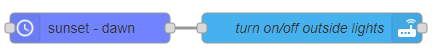
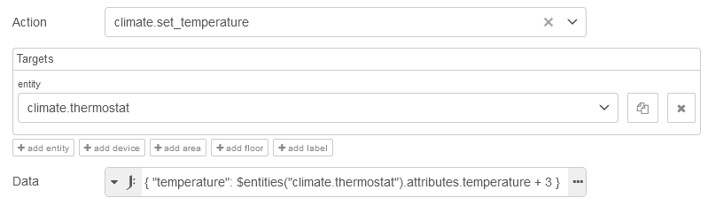

# Action Node Tips and Tricks

## Home Assistant Domain

The `homeassistant` domain is versatile, allowing you to control multiple entities across different domains with various services.

For example, you can use the `homeassistant` domain to turn off lights, switches, and any other devices in the laundry room with a single action call. This approach reduces the need for multiple action nodes.


## Using Mustache Templates

Mustache templates can be applied in the domain, service, and entity ID fields, which is especially useful for setting the service based on `msg.payload` or other message properties.

For instance, you can use [eztimer](https://flows.nodered.org/node/node-red-contrib-eztimer) to set the output of a node to `on` or `off`, and then use that output in the action node to determine the service to use.




@[code](@examples/guides/action_node/mustache_templates_01.json)

Mustache templates are also supported in the data field when set to JSON format.

**Related Resources:**

- [Mustache Templates](./mustache-templates.md)

## Targets

Target fields allow you to specify areas, devices, and/or entities, either individually or in combination. Note that not all services accept areas and devices.

Mustache templates and environment variables can be used within each target list.

## Data Field

::: tip
For the data field, it’s recommended to use the JSONata expression (`J: Expression`), as it offers several benefits over JSON:

- Handles quotes based on the type of variable
- Allows the insertion of complex variables such as arrays and objects
- Supports mathematical operations
  :::

### Inserting a Message Property into a String

#### Example: Sending a TTS Message When a Door is Opened


```json
{ "message": "The " & data.attributes.friendly_name & " has been opened.", "entity_id": "all" }
```

@[code](@examples/guides/action_node/door_sensor_tts.json)

### Retrieving a Property Value of a Home Assistant Entity

Home Assistant nodes support custom JSONata functions to fetch properties of any HA entity.

- `$entities()` returns all entities in the cache
- `$entities("entity_id")` returns a single entity from the cache that matches the given `entity_id`

#### Example: Getting the Friendly Name of an Entity

```json
{ "message": "The " & $entities("binary_sensor.front_door").attributes.friendly_name & " has been opened." }
```

#### Example: Getting Friendly Names of All Lights and Switches in an `On` State

```json
{
     "message": "The " & $join($entities().*[state = "on" and entity_id ~> /^light|^switch/].attributes.friendly_name, ", ") & " are on.",
     "title": "Left On"
}
```

### Performing Arithmetic Operations

Since Home Assistant states are represented as strings, you need to cast them to numbers in JSONata to perform arithmetic. Use the function [`$number()`](https://docs.jsonata.org/numeric-functions#number) for this purpose. Although most entity attributes are in the correct state, casting them as numbers ensures accuracy.

Example:

```
$number($entities("sensor.kitchen_lux").state)
```

#### Example: Adding 3 to the Current Temperature of a Climate Entity



```json
{ "temperature": $entities("climate.thermostat").attributes.temperature + 3 }
```

### Creating a Comma-Delimited Entity ID List

You can generate an entity ID list by retrieving entities using the get-entities node and then creating a comma-separated list to turn them off. In this example, the entity ID field is left blank as it is defined in the data field.


```json
{ "entity_id": $join(payload.entity_id, ",") }
```

@[code](@examples/guides/action_node/entity_id_list.json)

**Additional Resources:**

- [Action Node Documentation](../node/action.md)
- [JSONata Guide](./jsonata/)
- [JSONata Documentation](https://docs.jsonata.org)
- [JSONata Playground](http://try.jsonata.org)
