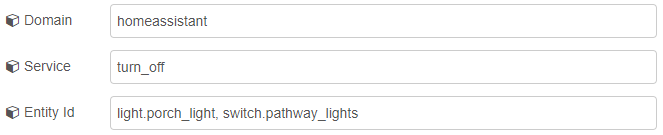
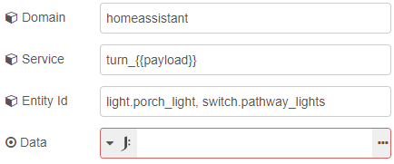
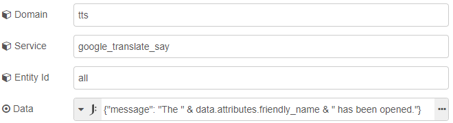
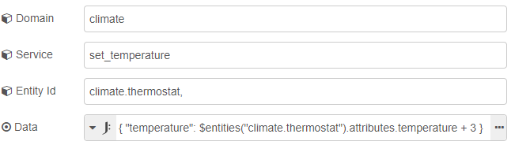

# Call Service Tips and Tricks

## Homeassistant Domain

The `homeassisant` domain can be used with different domains of entities with certain services.

Here's an example of using the `homeassistant` domain to turn off some lights, switches, and everything that can be turned off in the laundry room in a single service call. This can save you from having to have multiple call-service nodes.



## Using Mustache Templates

Mustache templates can be used in the domain, service, and entity id fields. This is useful if you want to set the service based on `msg.payload` or any other message property.

Here's an example using [eztimer](https://flows.nodered.org/node/node-red-contrib-eztimer) to set the output of the node to `on` or `off`. Then use that in the call-service node for which service to use.




<<< @/examples/guides/call-service/mustache_templates_01.json

Mustache templates are also accepted in the data field when their type is set to JSON.

**Also see:**

- [Mustache Templates](./mustache-templates.md)

## Targets

The target fields allow you to target areas, devices, and/or entities. Any combination can be used when they are available, some services don't accept areas and devices.

Mustache templates and environment variables can be used inside each target list.

## Data Field

::: tip
It's recommended to use the JSONata expression, `J: Expression`, for the data field as it has several advantages over JSON.

- Handles quotes based on the type of variable
- Allows the insertion of more complex variables such as arrays and object
- Mathematical operations are permitted

:::

### Inserting a message property into a string

#### Sending a TTS message when a door is opened




```json
{ "message": "The " & data.attributes.friendly_name & " has been opened." }
```

<<< @/examples/guides/call-service/door_sensor_tts.json

### Getting a property value of a Home Assistant entity

There's a custom function in JSONata inside Home Assistant nodes that allows the fetching of any property of an HA entity.

- `$entities()` returns all entities in the cache
- `$entities("entity_id")` returns a single entity from the cache matching the passed in `entity_id`

### Doing arithmetic

Home Assistant states are represented as strings so to be able to do arithmetic on them in JSONata they will need to be cast to a number first use [`$number()`](https://docs.jsonata.org/numeric-functions#number). Most attributes of entities are in their correct state but never hurt to be safe and cast them as a number.

`$number($entities("sensor.kitchen_lux").state)`

#### Adding 3 to the current temperature of a climate entity



```json
{ "temperature": $entities("climate.thermostat").attributes.temperature + 3 }
```

### Create a comma-delimited entity id list

Example of getting a list of lights from the get-entities node and then creating an entity id list to turn them off. The entity id field is left blank in this example as it is defined in the data field.


```json
{ "entity_id": $join(payload.entity_id, ",") }
```

<<< @/examples/guides/call-service/entity_id_list.json

**Also see:**

- [Call-service node](../node/call-service.md)
- [JSONata Guide](./jsonata.md)
- [https://docs.jsonata.org](https://docs.jsonata.org)
- [http://try.jsonata.org](http://try.jsonata.org)
