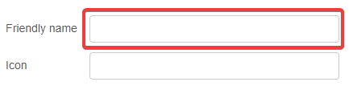

# Getting Started

## Installation

To install this custom integration, you can use [HACS](https://hacs.xyz/) or follow the manual installation instructions provided in the [README](https://github.com/zachowj/hass-node-red/blob/master/README.md#installation).

## Tip

When configuring an entity in Node-RED, consider filling in the "friendly name" field before your first deployment. This will create the entity with the specified `entity_id`. If left blank, it will default to `sensor.nodered_<node id>`, where `<node id>` is a unique identifier assigned by Node-RED. The `entity_id` can be changed later in Home Assistant.

