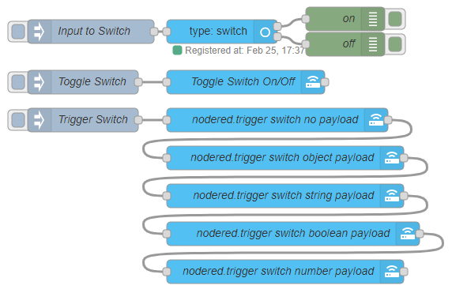

# Switch

_Part of the [entity node](../../node/entity.md)._

## Use cases

- Start a flow using the service call `nodered.trigger`. This can be used in any place that you can do a service call (e.g. Node-RED, Lovelace). When a switch is triggered the output path will depend on if the HA switch is on (top) or off (bottom).

- As a switch node where the condition is if the HA switch is on/off.

Sample Flow using the new switch entity:

@[code](@examples/guides/custom_integration/switch_01.json)
