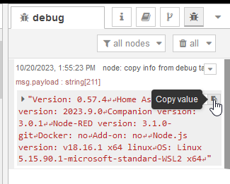

# Diagnostics Information

## Overview

To streamline troubleshooting, a diagnostics button has been added to the Node-RED editor. This button runs a diagnostics flow and copies the output to your clipboard for easy pasting into a GitHub issue or support forum.

::: tip Note
In versions prior to 0.62.0, the diagnostics flow was available as a separate flow that needed to be imported manually. You can still access and use this flow [here](#before-version-0-62-0).
:::


## For Versions Prior to 0.62.0

Before version 0.62.0, the diagnostics flow was a separate tool for collecting runtime and system environment data. It can still be imported into Node-RED to gather essential information for troubleshooting.

### Flow


You can also import this flow directly from the examples section in Node-RED:

- [How to Import a Flow](https://nodered.org/docs/user-guide/editor/workspace/import-export)

```json
@examples/diagnostic.json
```

### Usage

1. Import the flow into Node-RED.
2. Deploy the flow.
3. Click the `Inject` node to execute the flow.

   

4. Copy the output from the `Debug` tab.

   

5. Paste the copied output into a GitHub issue or support ticket.
