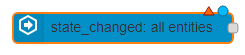
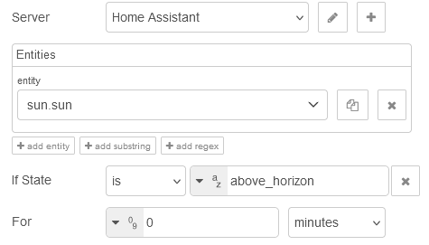
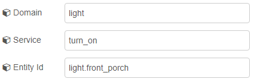
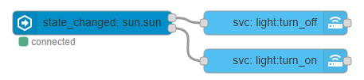

# First Automation

For your first automation, we'll start simple and set up an automation to turn on and off a
light when the sun comes up and goes down.

This example will use the state, `below_horizon`/`above_horizon`, of the `sun.sun` entity from
Home Assistant to trigger the light.

## Events: state

Place an Events: state node onto the workspace and double click on it to edit.

## Entity ID

We'll add `sun.sun` to the **Entity ID** field and leave the entity id filter type
to `Exact` as we only want to match one entity.

## If State

**If State** is a conditional that will be checked against the state of the entity
when it triggers the node. If the condition is found to be `true` the message
will be sent out the top output and if found to be `false` it will be sent out
the bottom output. If no conditional value is set there will only be one output
and all messages will flow through it.

For this example we will set the **If State** to `above_horizon`.

## Call Service

Now that the trigger is set up it's time to set up the action. Most communication
done with Home Assistant will come in the forms of services calls using the Call
Service Node.

Drag two Call Service nodes onto the workspace and connect them to each of the
outputs from the Events: state node.

Since we made the conditional in the Events: state node _if state is equal to
above_horizon_ the top output will be the action to turn off the light and the bottom output will be the action to turn on the light.

The three fields that are relevant for this example are: Domain, Service, and
Entity Id. **Domain** is going to be `light`, **Service** is going to be
`turn_off`, and **Entity Id** is going to be `light.front_porch`. The Second
Call Service node will be the same except the **Service** is going to be `turn_on`.

## Complete Automation

At this point, you can deploy and should have your first working automation in
Node-RED.

<<< @/examples/guides/first-automation/complete-automation.json

**Also see:**

- [Importing and Exporting Flows](https://nodered.org/docs/user-guide/editor/workspace/import-export)
- [Call Service Node](/node/call-service.md)
- [Events: state Node](/node/events-state.md)
- [Conditionals](./conditionals.md)
