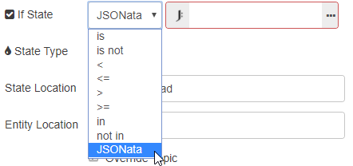
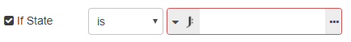

# JSONata

There are three functions added for JSONata expressions within the Home Assistant nodes.

- `$entity()` returns the entity that triggered the node
- `$prevEntity()` returns the previous state entity if the node is an event node
- `$entities()` returns all entities in the cache
- `$entities(entity_id)` returns a single entity from cache matching passed in entity_id

When JSONata appears in the conditional dropdown it expects the expression to return a boolean, true or false.

When it is chosen with a conditional, not JSONata it will return a value of the evaluated expression that will be checked against the conditional chosen.

## Examples

- [Increase lights brightness with remote](/cookbook/jsonata.html#increase-lights-brightness-with-remote)
- [Notification of lights left on when leaving home](/cookbook/jsonata.html#notification-of-lights-left-on-when-leaving-home)
- [OR conditional for the events: state node](/cookbook/jsonata.html#or-conditional-for-the-events-state-node)

**Also see:**

- [https://docs.jsonata.org](https://docs.jsonata.org)
- [http://try.jsonata.org](http://try.jsonata.org)
