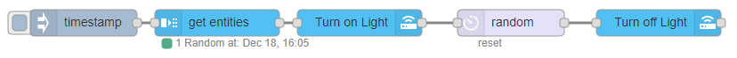

# Get Entities

The Get Entities node retrieves entities based on specific search criteria, with three different output options. This node is useful for filtering and finding entities that match certain conditions, such as all lights that are currently on, or sensors reporting a specific range of values.

## Configuration

### Search Criteria

All specified criteria must be met for an entity to be considered valid.

### Property

Autocomplete is available for all properties currently set on loaded entities.

## Inputs

### Payload

- **Type**: `Object`

Override the configuration values by passing in a property with a valid value.

- `rules` (array)
  - `condition`: string (e.g., `stateObject`, `labelRegistry`, `areaRegistry`, `deviceRegistry`, `floorRegistry`)
  - `property`: string
  - `logic`: string
  - `value`: string
  - `valueType`: string
- `outputType`: string
- `outputEmptyResults`: boolean
- `outputLocationType`: string
- `outputLocation`: string
- `outputResultsCount`: number

#### Example

To retrieve all entities with the device class `battery` on the `First floor` that are not labeled `not replaceable`, include the following in the `payload` property of the message:

```json
{
  "rules": [
    {
      "condition": "stateObject",
      "property": "attributes.device_class",
      "logic": "is",
      "value": "battery",
      "valueType": "str"
    },
    {
      "condition": "floorRegistry",
      "property": "name",
      "logic": "is",
      "value": "First floor",
      "valueType": "str"
    },
    {
      "condition": "labelRegistry",
      "property": "name",
      "logic": "is_not",
      "value": "not replaceable",
      "valueType": "str"
    }
  ]
}
```

## Outputs

### Array

- **Type**: `Array`

Returns an array of state objects based on the search criteria and sends them to the specified output location.

### Count

- **Type**: `number`

Returns the total count of valid entities.

### Random

- **Type**: `Object | Array`

Returns a random object or array from the available state objects. If `One Max Results` is selected, it will return a single object; otherwise, it will return an array of state objects.

### Split

- **Type**: `msg.part`

Sends a separate message for each state object, similar to the output of a split node.

## State Object Format

Sample output when the output type is an array:

```json
[
  {
    "entity_id": "light.kitchen",
    "state": "on",
    "attributes": {
      "brightness": 243,
      "friendly_name": "Kitchen Light",
      "supported_features": 33,
      "icon": "mdi:light-switch"
    },
    "last_changed": "2019-12-29T05:38:53.016984+00:00",
    "last_updated": "2019-12-29T05:38:53.016984+00:00",
    "context": {
      "id": "6c16e348494c42fb8c8e8bda92b20fb2",
      "parent_id": null,
      "user_id": null
    },
    "timeSinceChangedMs": 3466747
  }
]
```

### entity_id

- **Type**: `string`

The entity to which this state belongs.

### state

- **Type**: `string`

The main attribute state value, such as 'on', 'off', 'home', 'open', 'closed', etc.

### attributes

- **Type**: `Object`

Supported attributes of the state as set by Home Assistant.

### last_changed

- **Type**: `string`

ISO Date string representing the last time the entity state changed.

### timeSinceChangedMs

- **Type**: `number`

Milliseconds since the last state change of the entity.

### last_updated

- **Type**: `string`

ISO Date string representing the last time the entity state was updated.

### context

- **Type**: `Object`

Information about who or what last changed the state of this entity.

## Examples

<InfoPanelOnly>

[link](https://zachowj.github.io/node-red-contrib-home-assistant-websocket/node/get-entities.html#examples)

</InfoPanelOnly>

<DocsOnly>
### Example 1

Get a notification when you leave if any doors or windows are left open. Use the `get entities` node to get a list of entity IDs (e.g., `binary_sensor.front_door`, `binary_sensor.back_door`, `binary_sensor.front_window`, `binary_sensor.back_window`) where the state is `open`. The entities are returned with the output `Split`, sending a message for each valid entity. A template node can then format the payload into the entity's friendly name, and the messages can be joined back into one payload using the `join` node.


@[code](@examples/node/get-entities/example_01.json)

### Example 2

Create a vacation or away script to randomly turn on lights around your home. Use an `inject` node (or your preferred timer node) and the `get entities` node to randomly choose an entity from the criteria where `entity_id` starts with `light.`.



@[code](@examples/node/get-entities/example_02.json)

### Example 3

Join pre-defined messages based on separate entity states. Use the `get entities` and `function` nodes with the `Array` output option.


@[code](@examples/node/get-entities/example_03.json)

### Example 4

Get all lights in an area named "Kitchen" that are off.


@[code](@examples/node/get-entities/example_04.json)

</DocsOnly>

## References

- [Home Assistant State Objects](https://home-assistant.io/docs/configuration/state_object/)
