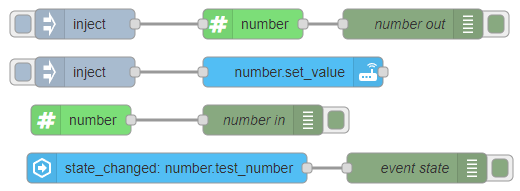

::: warning
_Needs [Custom Integration](https://github.com/zachowj/hass-node-red) installed
in Home Assistant for this node to function_
:::

# Number

Creates a number in Home Assistant which can be manipulated from this node.

## Configuration

### Value <Badge text="required"/>

- Type: `number`

The value of the entity should be updated to

## Inputs

properties of `msg.payload`

### value

- Type: `number`

The value of the entity should be updated to

## Outputs

Value types:

- `value`: The value of the entity
- `previous value`: The previous value of the entity
- `config`: The config properties of the node

## Examples

<InfoPanelOnly>

[link](https://zachowj.github.io/node-red-contrib-home-assistant-websocket/node/number.html#examples)

</InfoPanelOnly>

<DocsOnly>

#### Usage example

@[code](@examples/node/number/number_usage.json)

</DocsOnly>
