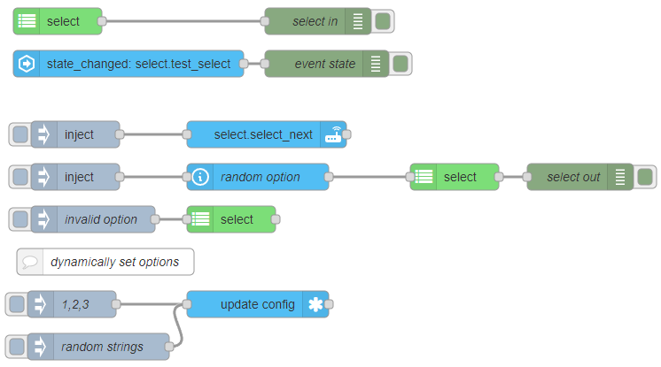

::: warning
_Needs [Custom Integration](https://github.com/zachowj/hass-node-red) installed
in Home Assistant for this node to function_
:::

# Select

The Select node creates a select entity in Home Assistant that can be manipulated from Node-RED. This type of entity typically represents a dropdown menu or a list of options from which the user can choose, and it can be used to control or adjust settings within your automations.

## Configuration

### Mode <Badge text="required"/>

- Type: 'listen' | 'get' | 'set'

The mode of the node

### value <Badge text="required"/>

- Type: `string`

A string to the set current value of the select entity

## Inputs

properties of `msg.payload`

### Value

- Type: `string`

The string of the text entity should be updated to

## Outputs

Value types:

- `value`: The text string of the entity
- `previous value`: The previous text string of the entity
- `config`: The config properties of the node

## Examples

<InfoPanelOnly>

[link](https://zachowj.github.io/node-red-contrib-home-assistant-websocket/node/select.html#examples)

</InfoPanelOnly>

<DocsOnly>

#### Usage example

@[code](@examples/node/select/select_usage.json)

</DocsOnly>
