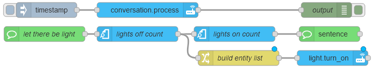
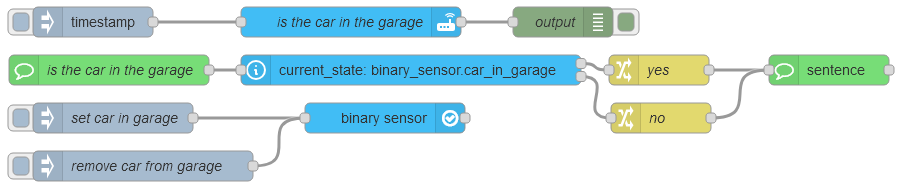

# Sentence

The **Sentence** node is triggered when the Home Assistant [Assist](https://www.home-assistant.io/voice_control/) feature matches a sentence from a voice assistant using the default [conversation agent](https://www.home-assistant.io/integrations/conversation/). This node enables voice control integrations, allowing specific voice commands to trigger automations within Node-RED.

Sentences support basic template syntax. Refer to the Home Assistant [documentation](https://www.home-assistant.io/docs/automation/trigger/#sentence-trigger) for more details.

::: warning
This node requires the [Custom Integration](https://github.com/zachowj/hass-node-red) to be installed in Home Assistant.
:::

## Configuration Options

### Mode

- **Type**: `string`
- **Options**:
  - `trigger`
  - `response`

Defines the node’s function.  
If set to **trigger**, the node activates when a sentence is matched.  
If set to **response**, the node sends a dynamic response back to Home Assistant.

### Sentences

- **Type**: `string`

A list of sentences to match. Supports basic template syntax. For more details, see the Home Assistant [documentation](https://www.home-assistant.io/docs/automation/trigger/#sentence-trigger).

### Response Type

- **Type**: `string`
- **Options**:
  - `dynamic`
  - `fixed`

Specifies the type of response sent to Home Assistant:

- **Fixed**: The same response is sent for all matched sentences.
- **Dynamic**: The response is determined by the node set to response mode.

### Response

- **Type**: `string`

The message sent to Home Assistant when a sentence is matched. This option is used only if the **Response Type** is set to `fixed`.

### Fallback Response

- **Type**: `string`

The message sent to Home Assistant when a timeout occurs. This is used when the **Response Type** is set to `dynamic`.

### Response Timeout

- **Type**: `number`

Specifies the time in milliseconds to wait for a response before sending the **Fallback Response**. This option is used only when the **Response Type** is set to `dynamic`.

### Expose As

- **Type**: `string`

Select an entity to create a switch in Home Assistant. Turning the switch on or off will enable or disable this node in Node-RED.

## Inputs

All properties must be provided in `msg.payload`.

Example input:

```json
{
  "response": "The light is now on"
}
```

### Response

- **Type**: `string`

The response sent to Home Assistant when a sentence is matched. This is used only when the **Response Type** is set to `dynamic`.

## Outputs

Value types:

- `trigger id`: The sentence that triggered the flow.
- `config`: The node's configuration properties.

## Examples

<InfoPanelOnly>

For detailed usage examples, see the [Examples](https://zachowj.github.io/node-red-contrib-home-assistant-websocket/node/sentence.html#examples) section.

</InfoPanelOnly>

<DocsOnly>

### Basic Usage


@[code](@examples/node/sentence/sentence_usage.json)

### Dynamic Response Examples

#### Example 1: Count Lights On and Off

This example shows how to use the Sentence node to provide a dynamic response based on the number of lights that are on or off in the house. It also turns on any lights that were off.



@[code](@examples/node/sentence/sentence_dynamic_response_01.json)

#### Example 2: Check Garage Sensor

This example checks the status of a binary sensor to determine whether the car is in the garage. If the car is present, a response is sent confirming its location. If the car is not present, the response states that the car is not in the garage.



@[code](@examples/node/sentence/sentence_dynamic_response_02.json)

</DocsOnly>
