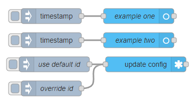

# Update Config

This node allows you to update the Home Assistant configuration of a node from within a flow. This is useful if you want to change the configuration of a node based on the state of an entity or some other event.

## Configuration

### Name

- Type: `string`

A name for the node.

### Server

- Type: `string`

The node id of a [Server Config](/node/config-server.md) node.

### Entity Config

- Type: `string`

The node id of an [entity config](/node/entity-config.md). This can be overridden by the `payload.id` property on the msg object.

## Inputs

All properties must be under `msg.payload` and will be ignored if not.

### id

- Type: `string`

The node id of an entity config.

### icon

- Type: `string`

The icon to use for the entity.

### name

- Type: `string`

The friendly name to use for the entity.

## Examples

<InfoPanelOnly>

[link](https://zachowj.github.io/node-red-contrib-home-assistant-websocket/node/update-config.html#examples)

</InfoPanelOnly>

<DocsOnly>

#### Usage example

@[code](@examples/node/update-config/use01.json)

</DocsOnly>
